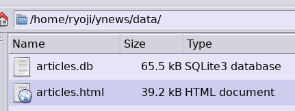

<pre><b>ryoji@ubuntu</b>:<b>~/ynews</b>$ mkdir data
<b>ryoji@ubuntu</b>:<b>~/ynews</b>$ chown 1000:1000 data
<b>ryoji@ubuntu</b>:<b>~/ynews</b>$ docker run -v &quot;$(pwd)/data:/app/data&quot; -u 1000:1000 ryojikodakari/ynews-mini-scraper-20200718 https://headlines.yahoo.co.jp/list/?m=kyodonews
</pre>

----

<pre><b>ryoji@ubuntu</b>:<b>/media/dev/20190220-ynews/golang/scraper/sqlite</b>$ go mod init github.com/growingspaghetti/20190220-ynews/golang/scraper/sqlite
go: creating new go.mod: module github.com/growingspaghetti/20190220-ynews/golang/scraper/sqlite
<b>ryoji@ubuntu</b>:<b>/media/dev/20190220-ynews/golang/scraper/sqlite</b>$ go build
go: finding module for package github.com/mattn/go-sqlite3
go: found github.com/mattn/go-sqlite3 in github.com/mattn/go-sqlite3 v1.14.0</pre>
