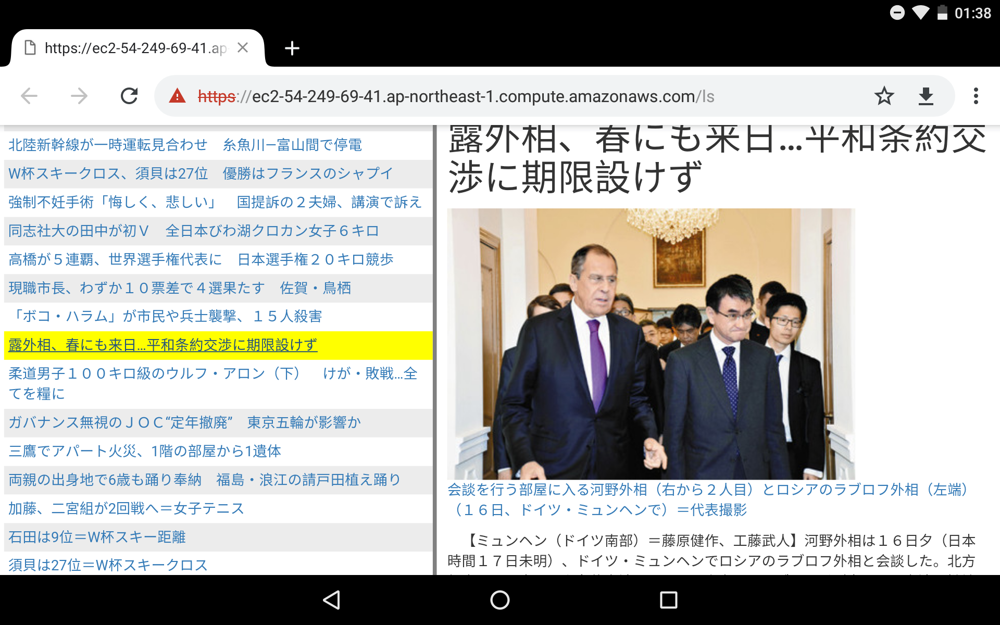
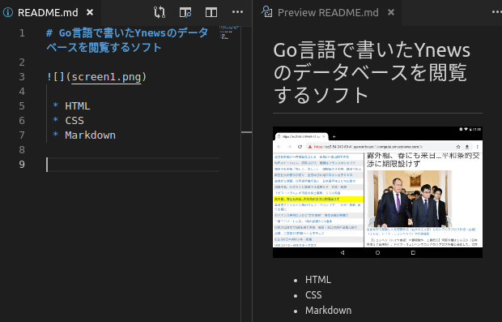
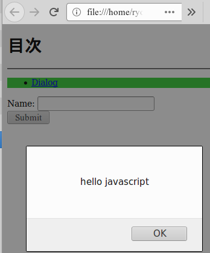
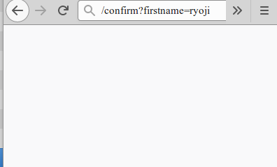

# Go言語で書いたYnewsのデータベースを閲覧するソフト



 * HTML
 * CSS
 * TiddlyWiki記法とMarkdown記法
 * 送信フォームとフォームバリュー



```
<!DOCTYPE html>
<html>
<body>

<h1>目次</h1>

<hr/>

<ul style='background-color:limegreen;'>
<li><a href='javascript:alert("hello javascript");'>Dialog</a></li>
</ul>

<form action="confirm">
  Name: <input type="text" name="firstname">
  <br />
  <input type="submit" value="送信">
</form>

</body>
</html>
```





```
// プログラム本文
// 　データベース開く
// 　ルートディレクトリページが開かれたら記事一覧転送手へ送る
// 　記事一覧ページが開かれたら記事一覧ページ生成手へ送る
// 　記事本文ページが開かれたら記事本文ページ生成手へ送る
// 　サーバーを起動
func main()
```