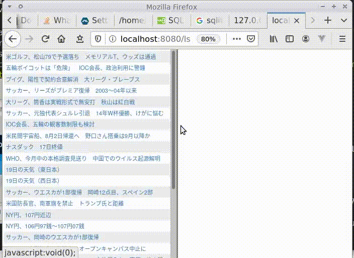

<pre><font color="#A6E22E"><b>ryoji@ubuntu</b></font>:<font color="#66D9EF"><b>~/ynews</b></font>$ docker run -v &quot;$(pwd)/data:/app/data&quot; -p &quot;8080:8080&quot; -u 1000:1000 ryojikodakari/ynews-mini-viewer-20200718</pre>

----

```
ryoji@ubuntu:~/dev/20190220-ynews/golang/viewer/sqlite$ go mod init github.com/growingspaghetti/20190220-ynews/golang/viewer/sqlite
go: creating new go.mod: module github.com/growingspaghetti/20190220-ynews/golang/viewer/sqlite
ryoji@ubuntu:~/dev/20190220-ynews/golang/viewer/sqlite$ go build
go: finding module for package github.com/mattn/go-sqlite3
go: found github.com/mattn/go-sqlite3 in github.com/mattn/go-sqlite3 v1.14.0
```

----

```
mkdir data
chown 1000:1000 data
docker-compose up
# sqlite_scraper_1 exited with code 0
# go to localhost:8080
docker-compose down
```
