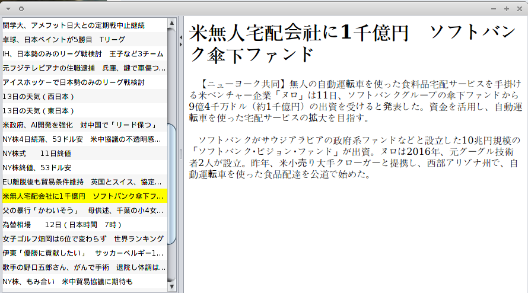

# Javaで書いたニュース記事のデータベースビューワー



```
    // Guiとはフレーム部品(ウィンドウ部品)
    // 　・パネル部品
    // 　・リスト内容
    // 　・リスト部品
    // 　・ブラウザ部品
    // 　その初期化する時は〜
    // 　そのリスト内容を初期化する時は〜
    // 　そのリストの選択に変更があった時は〜
    // 　記事本文をデータベースから取り出す（URLの）時は〜
    //
    public class Gui extends JFrame
```

```
    // ■フレーム部品
    //　 ×ボタンが押された時は〜
    // 　　各個適宜定義
    //　 初期化時は〜
    // 　　各個適宜定義
    // 　・サイズ
    // 　・表示位置
    // 　・表示非表示
    // 
    //
    // Guiとはフレーム部品
    // 　×ボタンが押された時は〜
    // 　　終了
    // 　初期化時は〜
    // 　　リストを初期化したり諸々せよ
    // 　サイズは900x500
    // 　表示位置は画面真ん中
    // 　表示非表示は表示
    //
    //
    // プログラム本文
    // 　フレーム部品たるGuiを作成して
    // 　それを初期化
    // 　表示設定を表示に
    public static void main(String[] args)
```
