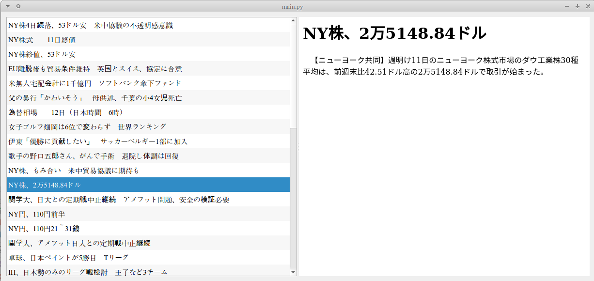

# python3とQt5で書いたニュース記事のデータベースのビューワー

 * Qtグラフィカルユーザーインターフェイスライブラリ
 * クラス
   ```
   class App(QWidget):
   ```
 * プログラム本文
   ```
   if __name__ == '__main__':
   ```



```
# ■QStyledItemDelegateとは
# 　・値
# 　・displayTextする〜
# 　　各個適宜定義
#
# ItemDelegateとはQStyledItemDelegate
# 　そのdisplayTextした時は〜
# 　　自身の値【1】で戻る

# AppとはQWidget
# 　その初期化する時は〜
# 　そのユーザーインターフェイスを初期化する時は〜
# 　記事本文をデータベースから取り出す（URLの）時は〜
# 　そのブラウザに記事をセットする時は〜
# 　そのリストを初期化する時は〜
#

# プログラム本文
# 　以下、QTアプリケーションを開始する
# 　QWidgetたるAppを作成して
# 　それを実行
```